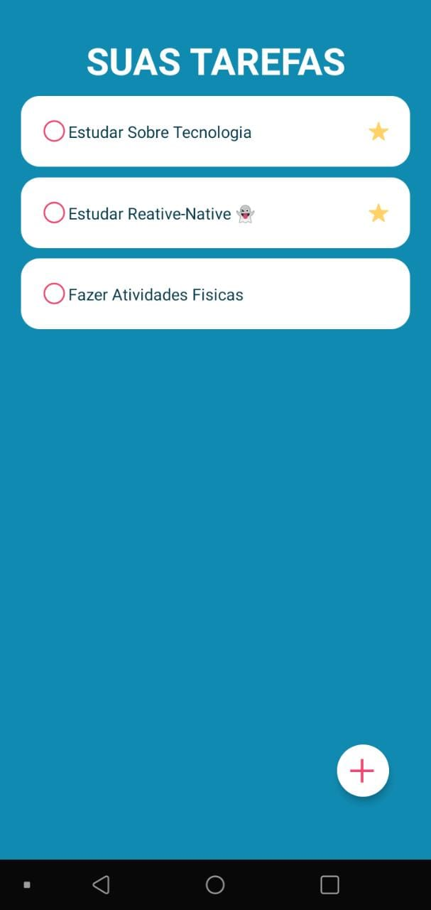

# TO DO List




Um app de to-do list feito com React-Native 

[Read in English](./README-en.md)

## Sobre o Projeto ⁉

É um app de to-do list padrão, você pode adicionar tarefas que serão feitas no seu dia e essas informações ficam salvas no dispositivo. Adicionei também um esquema de prioridades onde as tarefas que possírem prioridade acima daquelas que não possuem.

O projeto foi feito usando o React-native, e algumas bibliotecas como a [react-native-async-storage](https://react-native-async-storage.github.io/async-storage/docs/install/) e o [react-native-animatable](https://github.com/oblador/react-native-animatable)

---

## Tecnologias

- React-Native

## Experiência com o Projeto

Meu primeiro aplicativo feito em react-native. Estava curioso com a tecnologia e decidi pesquisar mais a respeito 
e fazer esse projeto 🧐. Encontrei algumas dificuldades para emular o app no meu computador, acabei usando meu próprio celular e ainda tive algumas dificuldades mas consegui solucionar 😑. Como já tenho alguma experiência com reactjs não foi muito difícil me adaptar mas foi uma boa experiência. 

---

## Teste o app :)

Para testar o app é necessário que você tenha o expo instalado em seu computador. Tendo o expo instalado você pode rodar os seguites comandos

```(git)
git clone https://github.com/GustavoMont/to-do-list.git

npm i

expo start
``` 